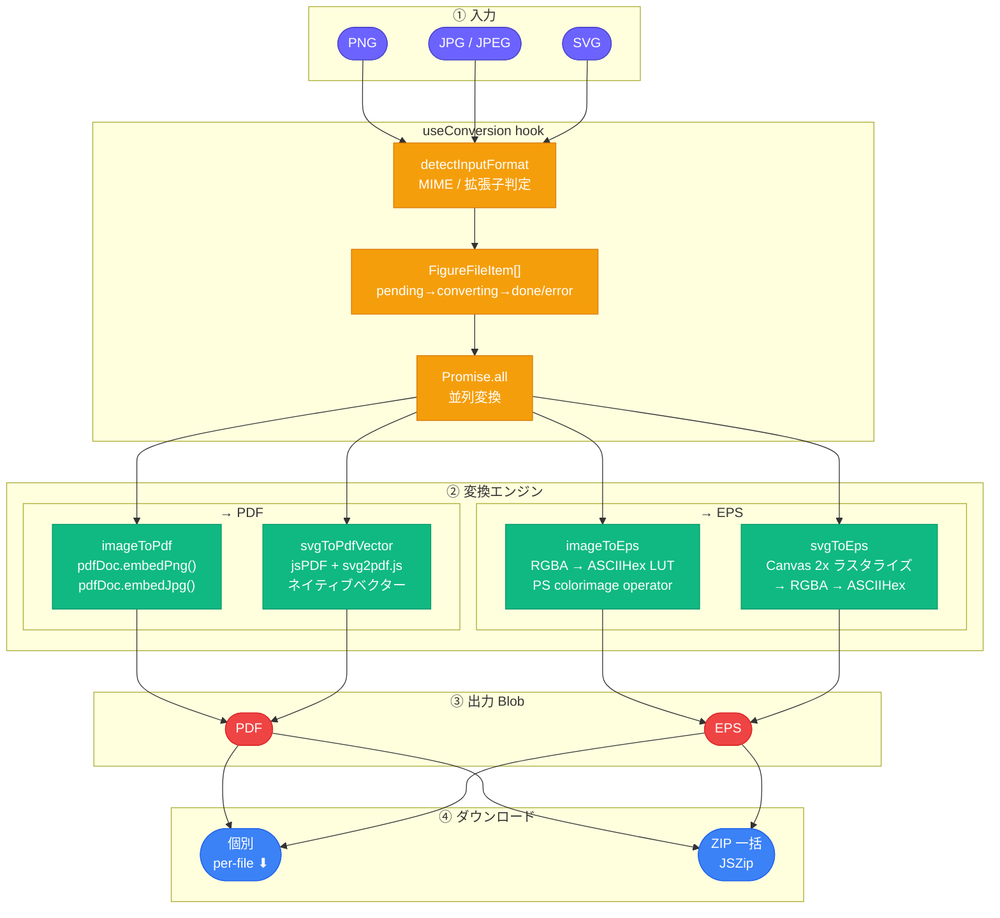
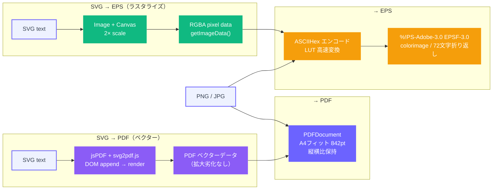

# LaTeX Figure Composer

**研究画像を論文向け PDF / EPS に変換するツール**

[](https://react.dev)
[](https://www.typescriptlang.org)
[](https://vitejs.dev)
[](https://pdf-lib.js.org)
[](https://github.com/parallax/jsPDF)
[](https://stuk.github.io/jszip)
[](LICENSE)

---

## プロジェクト概要

LaTeX 論文執筆において、**PNG・JPG・SVG 形式の画像を `\includegraphics` に適した PDF または EPS に変換する** Web アプリケーションです。

- PNG / JPG / JPEG / SVG を PDF または EPS にブラウザ内で変換
- 複数ファイルの一括変換（並列処理）とまとめて ZIP ダウンロード
- ファイルを選択して個別またはまとめてダウンロード
- バックエンド・サーバー不要。ブラウザだけで完結

**公開 URL：** *(デプロイ予定)*

---

## 課題背景

千葉工業大学 2026年前期「Web3・AI概論」の第6回課題（テーマ：プロトタイプ v3）として作成しました。

**解決したかった問題：**
LaTeX で論文を書く際、`\includegraphics` には PDF または EPS が推奨されるが、手元にある画像は PNG や JPG が多い。変換のたびに ImageMagick や Ghostscript を手動実行したり、オンラインツールを使ったりする手間が発生していた。

**対象ユーザー：**
LaTeX / Overleaf で論文を書く学部生・大学院生・研究者。複数の図をまとめて変換したい人。

**一言紹介：**
画像をドロップするだけで、LaTeX に貼れる PDF / EPS が手に入る、研究者のための図版変換ツール。

---

## 主な機能

### 対応フォーマット

| 入力 | → PDF | → EPS |
|------|-------|-------|
| PNG  | ✅ | ✅ |
| JPG / JPEG | ✅ | ✅ |
| SVG  | ✅（ネイティブベクター: jsPDF + svg2pdf.js） | ✅（Canvas ラスタライズ経由） |

### 変換機能

- **PDF 変換（PNG / JPG）**：pdf-lib を使用。A4 ページ（842pt）にアスペクト比を保ってフィット
- **PDF 変換（SVG）**：jsPDF + svg2pdf.js によるネイティブベクター PDF 出力。拡大しても劣化しないベクターデータとして埋め込み
- **EPS 変換**：PostScript Level 2 の `colorimage` オペレータを使用。ASCIIHexDecode フィルタ、72 文字折り返し。Ghostscript・LaTeX の双方で読み込み確認済み
- **SVG → EPS**：`` + Canvas で 2x スケールにラスタライズしてから変換（シャープな出力）

### バッチ処理・ダウンロード

- 複数ファイルをまとめてドロップまたは選択
- `Promise.all` による並列変換（ファイルごとに `pending → converting → done / error` を表示）
- 変換完了後にチェックリストから任意のファイルを選択し：
  - **個別ダウンロード**（`⬇ PDF` / `⬇ EPS` ボタン）
  - **ZIP 一括ダウンロード**（`⬇ ZIP` ボタン）
- `Select All` / `Deselect All` による一括選択切り替え

### UI

- ファイルリストの折りたたみ / 展開トグル（ファイル数が多い場合のスクロール軽減）
- ファイル追加（ドラッグ&ドロップ / ファイル選択）は常時可能
- `✕ Clear All`（セクションヘッダー・リスト末尾の両方）

---

## Screenshot

> **Add screenshot here.**
> `docs/screenshot.png` を配置後、以下のコメントアウトを解除してください。

<!--  -->

---

## アーキテクチャ



### 変換パス詳細



---

## 技術スタック

| カテゴリ | 採用技術 |
|---------|---------|
| フレームワーク | React 18 + TypeScript 5（strict モード） |
| ビルド | Vite |
| PDF 生成（PNG/JPG） | pdf-lib |
| PDF 生成（SVG ベクター） | jsPDF + svg2pdf.js |
| ZIP 生成 | JSZip |
| EPS 生成 | Canvas API + 自前 PostScript 生成 |
| スタイリング | Pure CSS（CSS Custom Properties、Tailwind 等不使用） |
| AI アシスタント | Claude Code (Anthropic) |
| デプロイ | Vercel（予定） |

---

## セットアップ

```bash
# リポジトリをクローン
git clone https://github.com/Axe0320/latex-figure-composer.git
cd latex-figure-composer

# 依存パッケージをインストール
npm install

# 開発サーバーを起動
npm run dev
# → http://localhost:5173

# ビルド
npm run build
```

---

## ファイル構成

```text
latex-figure-composer/
├── src/
│   ├── App.tsx                    # メインコンポーネント・状態管理・UI全体
│   ├── index.css                  # スタイル定義（CSS カスタムプロパティ）
│   ├── main.tsx                   # アプリエントリーポイント
│   ├── vite-env.d.ts              # Vite 型定義（CSS import 対応）
│   │
│   ├── types/
│   │   └── conversion.ts          # InputFormat / OutputFormat / FigureFileItem 型
│   │
│   ├── utils/
│   │   └── fileHelpers.ts         # フォーマット検出・ファイルサイズ整形・ObjectURL 管理
│   │
│   ├── converters/
│   │   ├── imageToPdf.ts          # PNG/JPG → PDF（pdf-lib embedPng/embedJpg）
│   │   ├── svgToPdfVector.ts      # SVG → PDF（jsPDF + svg2pdf.js ネイティブベクター）
│   │   ├── imageToEps.ts          # PNG/JPG → EPS（RGBA → ASCIIHex → PS colorimage）
│   │   └── svgToEps.ts            # SVG → EPS（Canvas 2x ラスタライズ → imageToEps 共有関数）
│   │
│   ├── hooks/
│   │   └── useConversion.ts       # 変換状態管理・addFiles / convertAll（Promise.all）
│   │
│   └── components/
│       ├── Header.tsx             # タイトル・説明文
│       ├── FileUploader.tsx       # ドロップゾーン（複数ファイル対応）
│       ├── FileList.tsx           # ファイル一覧（サムネイル・ステータス・削除）
│       ├── FormatSelector.tsx     # PDF / EPS トグル
│       ├── ConvertButton.tsx      # 変換実行ボタン
│       ├── BatchResult.tsx        # 変換結果・チェックリスト選択・ダウンロード
│       └── ErrorArea.tsx          # エラー表示
│
├── test/                          # テスト用アプローチ図（論文スタイル）
│   ├── approach.svg
│   ├── approach.png
│   ├── approach.jpg
│   └── approach.jpeg
│
├── index.html
├── vite.config.ts
├── tsconfig.json
└── package.json
```

---

## 制限事項

- **SVG → EPS はラスタライズ**：SVG → EPS は Canvas で 2x スケールにラスタライズしてから変換するため、ビットマップ埋め込みになります。EPS でのベクター出力が必要な場合は他のツールを使用してください。
- **SVG の外部フォント・CSS**：SVG → EPS 変換（Canvas 経由）では、外部フォントや複雑な CSS が反映されないことがあります。SVG → PDF（jsPDF + svg2pdf.js）は多くのケースで対応済みです。
- **EPS のファイルサイズ**：ASCIIHex エンコードは各ピクセルを 6 文字で表現するため、高解像度画像では EPS ファイルが大きくなります。
- **チャンクサイズ警告**：pdf-lib と JSZip の合計サイズが 500KB を超えるため、Vite のビルド時に警告が出ます（動作には影響ありません）。

---

## Version History

| Version | Focus | 主な追加機能 |
|---|---|---|
| v1 (Phase 1) | PDF 変換 | PNG / JPG / JPEG / SVG → PDF、画像プレビュー、A4 フィット |
| v2 (Phase 2) | EPS 変換 | PNG / JPG / JPEG / SVG → EPS（PostScript Level 2 ASCIIHex）|
| v3 (Phase 3) | バッチ処理・UI | 複数ファイル一括変換、ステータス追跡、折りたたみ、チェックリスト選択、ZIP / 個別ダウンロード |
| v4 | ベクター PDF | SVG → PDF をネイティブベクター出力に変更（jsPDF + svg2pdf.js）。拡大しても劣化しない PDF を生成 |

---

## Roadmap

- [x] PNG / JPG / JPEG → PDF
- [x] SVG → PDF
- [x] PNG / JPG / JPEG → EPS
- [x] SVG → EPS
- [x] 複数ファイル一括変換
- [x] ZIP 一括ダウンロード
- [x] ファイル選択・個別ダウンロード
- [x] SVG のネイティブベクター PDF 出力
- [ ] WebP / TIFF 対応
- [ ] Vercel デプロイ

---

## 関連プロジェクト

本プロジェクトは LaTeX Research Toolkit の一部として、以下のツールと同一の UI 設計・アクセントカラー（`#6C63FF`）を共有しています。

| ツール | 概要 |
|--------|------|
| [Citation ⇄ BibTeX Converter](https://github.com/Axe0320/citation-bibtex-converter) | 引用テキスト・DOI・URL から BibTeX を生成・変換 |
| [LaTeX Table Composer](https://github.com/Axe0320/latex-table-composer) | 表データを論文向け LaTeX に変換・整形 |

---

## 備考

本リポジトリは、千葉工業大学「Web3・AI概論」第6回課題の要件である以下を満たすよう作成しています。

1. AI 支援（Claude Code）を活用したプロトタイプ開発
2. 研究・学習上の実課題を解決するプロダクトの試作
3. GitHub へのソースコード公開
4. Vercel へのデプロイ（予定）

---

## License

[MIT License](LICENSE)
